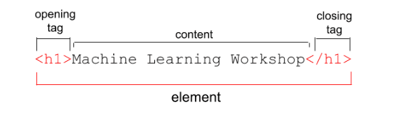
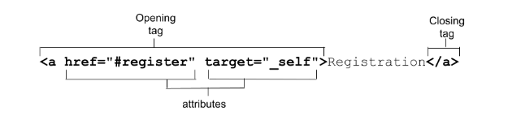

##### OVERVIEW

HTML (HyperText Markup Language) là một ngôn ngữ đánh dấu siêu văn bản dùng để mô tả cấu trúc của trang web. HTML bao gồm tâp hợp của các element và attribute được sử dụng để đánh dấu (mark up) tất cả components (thành phần) của tài liệu nhằm cấu trúc nó một cách ý nghĩa.

HTML document về cơ bản là tree of node bao gồm :

- HTML element.
- text node.

###### Element

HTML bao gồm tập hợp của nhiều element. Cấu trúc của một thẻ

###### Attribute

